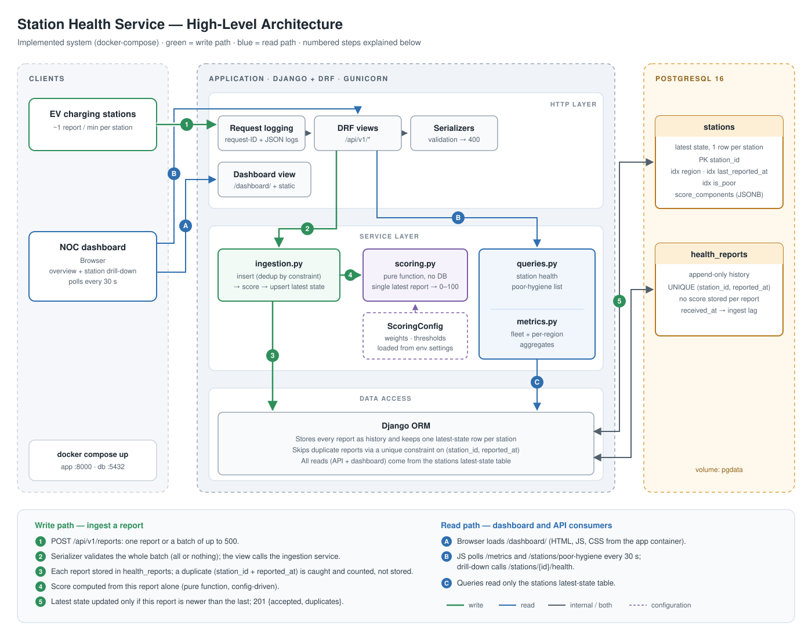

# Station Health Service — Architecture & Design

A small service that ingests health reports from EV charging stations, computes a network hygiene score per station, and exposes APIs for NOC operators to find problematic stations.

---

## 1. Assumptions

| Area | Assumption |
|---|---|
| Report frequency | Each station reports roughly once per minute; retries and duplicates are expected. |
| Ordering | Reports can arrive late or out of order (flaky cellular links, backlog flush after reconnect). |
| Region | Not in the specified payload. The API accepts an optional `region` field; a station keeps the region from its first report, defaulting to `unassigned`. |
| Firmware | "Outdated" means below a configured minimum supported version (`MIN_SUPPORTED_FIRMWARE`). Unparseable versions count as unknown. |
| Scoring basis | The score is computed from each station's single most recent report, not a rolling window. This keeps the formula and the ingestion path simple, at the cost of a report that isn't representative on its own being able to flip a station's flag. See Section 4. |

---

## 2. High-Level Architecture

### As implemented (local)



Full parameter-level detail (config, schema, API contracts, algorithms, frontend) is in [docs/LLD.md](docs/LLD.md).

- **Framework: Django + DRF.** It matches the team's stack, the ORM and migrations are mature, and `drf-spectacular` generates the OpenAPI spec. FastAPI was considered; its advantage (async I/O throughput) matters mostly for the ingestion tier at scale, which Section 6 handles by decoupling ingestion with a queue instead.
- **Layering:** thin views and serializers handle HTTP and validation only. Business logic lives in a service layer. Scoring is a **pure function** with no database or framework imports, so it can be unit-tested in isolation and later moved into a queue worker unchanged.

```
app/
  stations/
    models.py        # Station, HealthReport
    serializers.py   # request validation
    views.py         # thin HTTP layer
    services/
      ingestion.py   # per-report upsert + latest-state update
      scoring.py     # pure scoring function
      queries.py     # health / poor-hygiene read queries
      metrics.py     # aggregation queries
  dashboard/         # static HTML/JS dashboard, served at /dashboard/
  tests/
    unit/  integration/
```

---

## 3. Data Model

Two tables: an append-only history (satisfies "persist reports in a relational database"), and a latest-state table so read APIs never scan history.

**`health_reports`** (append-only)

| Column | Type | Notes |
|---|---|---|
| id | BIGSERIAL PK | |
| station_id | VARCHAR FK → stations | |
| reported_at | TIMESTAMPTZ | device timestamp |
| received_at | TIMESTAMPTZ | server timestamp |
| connectivity_status | VARCHAR + CHECK (`online`, `offline`) | |
| latency_ms | INTEGER CHECK ≥ 0 | |
| error_count | INTEGER CHECK ≥ 0 | |
| firmware_version | VARCHAR | |

`UNIQUE (station_id, reported_at)` makes a retried report a no-op: the database itself rejects the duplicate insert (caught as an `IntegrityError`) rather than the application racily checking first.

**`stations`** (latest state, one row per station)

| Column | Type | Notes |
|---|---|---|
| station_id | VARCHAR PK | |
| region | VARCHAR, indexed | |
| last_reported_at | TIMESTAMPTZ, indexed | |
| connectivity_status, latency_ms, error_count, firmware_version | | from the newest report |
| hygiene_score | NUMERIC(5,2) | |
| score_components | JSONB | per-component breakdown, explains *why* a score is low |
| is_poor | BOOLEAN, indexed | keeps the poor-hygiene query cheap |

Raw request bodies are deliberately **not** stored separately; `health_reports` already is the raw record. Structured logs carry the request ID and outcome per ingest call.

**Out-of-order handling:** every report is still inserted into history (so it isn't lost), but the "latest state" fields on `stations`, and therefore the current score, are only overwritten if the incoming `reported_at` is newer than the stored `last_reported_at`. A late report can never make a station look like it went back in time. This check is a simple field comparison, not a locked read-recompute-write cycle (see Section 13 for the concurrency trade-off that follows from that).

---

## 4. Network Hygiene Score

The score is computed from a station's **single most recent report** — deliberately the simplest reasonable formula, not a rolling average. Four weighted components, each normalized to 0–1:

| Component | Weight | Calculation |
|---|---|---|
| Availability | 40 | 1.0 if `online`, 0 if `offline` |
| Latency | 25 | 1.0 at ≤ 200 ms, linear to 0 at ≥ 2000 ms; 0 if offline (latency isn't meaningful for an offline station) |
| Errors | 25 | 1.0 at 0 errors, linear to 0 at ≥ 10 errors |
| Firmware | 10 | 1.0 if ≥ minimum supported version, 0.5 if unparseable, 0 if older |

`score = Σ weight × component` (range 0–100). A station is **poor** when `score < 60`. Weights and thresholds live in settings (`stations/config.py`) and are validated at startup (weights must sum to 100, latency bounds ordered, firmware minimum must parse).

Availability carries the most weight because an offline charger is the most direct customer impact. `score_components` is stored alongside the score so the API and dashboard can show *why* a station is flagged, without recomputing anything.

**Trade-off, deliberately accepted:** because the score comes from one report, a single bad reading can flip a station poor, and a single good one can clear it, even if the station is flapping. A rolling window (e.g. last N reports, or last N minutes) would smooth that out, at the cost of the added complexity described in Section 13. I chose the single-report version for its simplicity and documented the trade-off rather than build the window.

---

## 5. API Design

All endpoints are under `/api/v1`. OpenAPI schema at `/api/schema/`, Swagger UI at `/api/docs/`.

| Method & path | Purpose |
|---|---|
| `POST /reports` | Ingest one report or a JSON array (max 500). Returns `201` with `{accepted, duplicates}`. Duplicates are not errors, which makes client retries safe. |
| `GET /stations/{station_id}/health` | Latest status, score, component breakdown, `is_poor`. `404` if unknown. |
| `GET /stations/poor-hygiene` | Stations with `is_poor = true`, lowest score first. Optional `region` filter, `limit` (default/cap in settings). |
| `GET /metrics` | Fleet aggregates: station count, online/offline counts, average latency, average score, poor count. `group_by=region` for per-region rows. Computed from the latest-state table with a single `GROUP BY`. |
| `GET /healthz` | Liveness and DB connectivity for container orchestration. |

**Validation:** `connectivity_status` enum; `latency_ms` and `error_count` non-negative; timezone-aware timestamps only; timestamps more than 1 day in the future, or older than `MAX_REPORT_AGE_DAYS` (30 days), are rejected. Errors return `400` with field-level messages.

**Auth:** none. Every endpoint is open (see Security for what production would add).

**Dashboard.** A single page of plain HTML and JavaScript, served by Django at `/dashboard/`. It uses only the public API above. An overview shows fleet KPIs, the poor-hygiene list with a region filter, and a per-region breakdown; a drill-down shows one station's current score and component breakdown. It polls every 30 seconds rather than using WebSockets: data only changes once a minute per station, so push would add infrastructure without adding freshness. No build step, no separate container, no CORS configuration.

---

## 6. Future Scope

- **Authentication/authorization** — not implemented; every endpoint is open (Section 8).
- **Staleness / silent-station detection** — "flag stations whose score falls below a threshold" doesn't require tracking silence; adding it later is a scheduled job, not a scoring change (Section 7).
- **State-transition event log (`station_events`)** — a nice-to-have for alerting and audit history, not required by the current read APIs (Section 7).
- **Rolling-window scoring, per-report score history, and the resulting row-locking / idempotent multi-row insert machinery** — the single-report formula (Section 4) is simpler, is still "any reasonable formula," and removes the need to recompute and store a score per report. The accepted trade-off: two concurrent writes for the *same* station could theoretically race on which one's fields end up as "latest," since there is no row lock. At this scale that's an acceptable, documented simplification; Section 6 describes the queued design that would remove the race entirely at 100K+ stations by serializing per-station writes through a single worker.
- **Cursor pagination** — a plain `limit` is enough for "list all stations with poor hygiene"; cursor-based paging solves a scale problem this system doesn't have yet.
- **Queued ingestion, alerting, anomaly detection, and multi-region** — described in Sections 6–7 but not implemented. The service is synchronous by design, and the service-layer boundary (`stations/services/ingestion.py`) is where a queue would slot in without changing the scoring logic or the read API contract.
